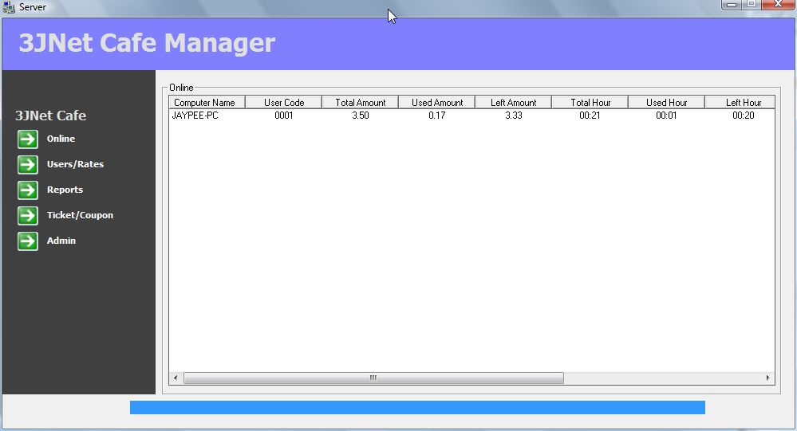



## An Internet Cafe Monitoring System

### Description

Updated some missing variables that returns an error when compiling.

A must have features for internet cafe monitoring system:

1. Allow connection from multiple computer

2. Detailed information about connected computer like computer name, user code, total amount, used amount, left amount, total hour, used hour, left hour, etc.

3. Time plan

4. Member and walk-in customer

5. User's rate information

6. Automatic generation of a coupon/user code and password

7. History report

8. And best of all I did not use any 3rd party controls

9. And a lot more...

Visit www.sourcecodester.com for more information about this source code.
 
### More Info
 

             |
---                |---
**Submitted On**   |2008-11-16 15:06:06
**By**             |[jaypabs](https://github.com/Planet-Source-Code/PSCIndex/blob/master/ByAuthor/jaypabs.md)
**Level**          |Advanced
**User Rating**    |4.9 (34 globes from 7 users)
**Compatibility**  |VB 6\.0
**Category**       |[Complete Applications](https://github.com/Planet-Source-Code/PSCIndex/blob/master/ByCategory/complete-applications__1-27.md)
**World**          |[Visual Basic](https://github.com/Planet-Source-Code/PSCIndex/blob/master/ByWorld/visual-basic.md)
**Archive File**   |[An\_Interne213918132009\.zip](https://github.com/Planet-Source-Code/jaypabs-an-internet-cafe-monitoring-system__1-71412/archive/master.zip)

